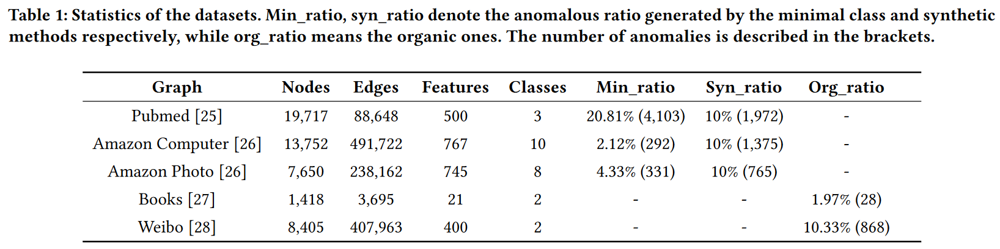

## Mul-Graph: A Graph Anomaly Detection Framework via Aggreating Mul-view information

**All the experiment results can be track in this code, including the production of figures.**

### Introduction

In this paper, we propose a multi-view fusion approach for graph anomaly detection (Mul-GAD) to tackle the poor generalization problem. We achieve the state-of-the-art detection performance and generalization in most scenarios via a series of experiments conducted on Pubmed, Amazon Computer, Amazon Photo, Weibo and Books.


### Requirements
It's worth noting that we use [pyg](https://github.com/pyg-team/pytorch_geometric) (torch_geometric) and [dgl](https://github.com/dmlc/dgl) library. It may be a little hard to make the both library installed. The [pyod](https://github.com/yzhao062/pyod) and [pygod](https://github.com/pygod-team/pygod) library (famous anomaly detection and graph anomaly detection library) is used to obtain the baseline AUC for simplicity.

```python
conda install -r requirements.txt
# or
pip install -r requirements.txt
```
### How to run

* The files of `run with something` get the experiment results in the paper.
For example, to run the baseline, just with code below:
```python
python run_baseline.py
```
Likewise, run_feature_level get the result of fusion on the feature level.

* The series of `plot with something` files generates the figures to observe tendency in data.
Run like above, for example:
```python
python plot_for_feature_level.py
```

**NOTES**:
1. For simplicity, we do not use the argument parser. Just rewrite the globle hyper-parameters at the top of files to change the dataset or something matters.
2. We run with NVIDIA GeForce RTX 3080 laptop GPU. The runnning time is no more than three hours for every files in 3080 case. 

### Results


  

### Citation
```html
@article{liu2022mul,
  title={Mul-GAD: a semi-supervised graph anomaly detection framework via aggregating multi-view information},
  author={Liu, Zhiyuan and Cao, Chunjie and Sun, Jingzhang},
  journal={arXiv preprint arXiv:2212.05478},
  year={2022}
}
```
